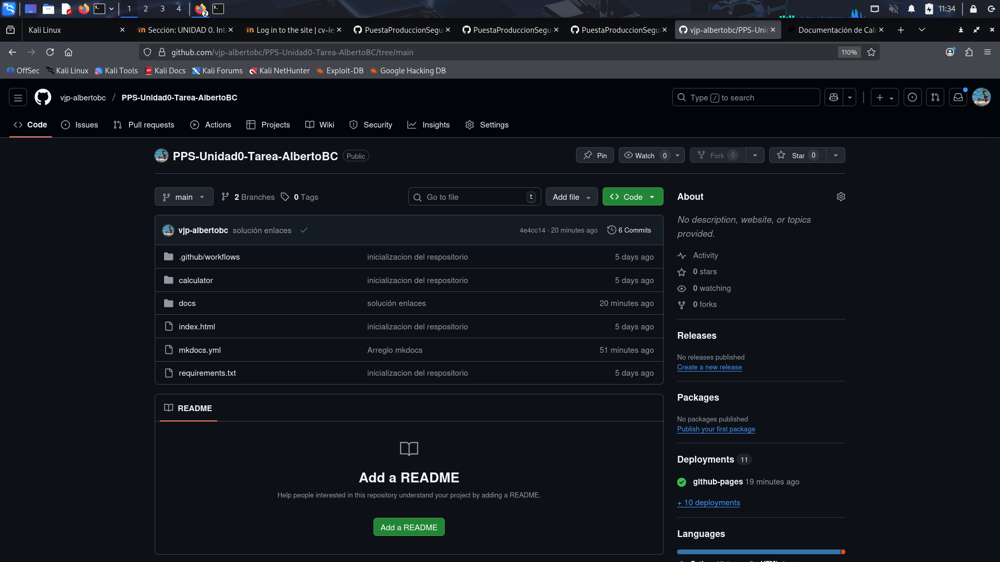

# 1. Creación y Configuración del Repositorio
## 1.1. Configuración Inicial (Local)
### Variables de Entorno
Se definen variables para agilizar el proceso de copiado de comandos (Asegúrate de sustituir los valores):
```bash 
Tu_nombre="AlbertoBC" 
Tu_mail_github="aberrocalc03@iesvalledeljerteplasencia.es" 
Tu_usuario_github="vjp-albertobc"
```
### Configuración de Usuario
Se configuran las credenciales globales y preferencias de Git:
```bash 
git config --global user.name $Tu_usuario_github
git config --global user.email $Tu_mail_github
git config --global init.defaultBranch main
git config --global core.editor nano
git config --global core.pager ""
```
### Generación y Configuración de Clave SSH
Se genera la clave SSH para establecer una conexión segura entre el equipo local y GitHub, y se añade al agente:
```bash 
ssh-keygen -t ed25519 -C $Tu_mail_github
eval "$(ssh-agent -s)"
ssh-add ~/.ssh/id_ed25519
```
Se obtiene la clave pública para añadirla en **GitHub** (**Settings** > **SSH and GPG keys**):
`cat ~/.ssh/id_ed25519.pub`
## 1.2. Creación del Repositorio Remoto y Clonación
Repositorio creado en GitHub como **`PPS-Unidad0-Tarea-AlbertoBC`** (Público).
```bash 
git clone git@github.com:$Tu_usuario_github/PPS-Unidad0-Tarea-$Tu_nombre.git
cd PPS-Unidad0-Tarea-$Tu_nombre`
```
## 1.3. Creación de la Estructura de Archivos
Estructura creada con `mkdir -p` y `touch`.
```bash 
# Crear directorios y el WorkFlow
mkdir -p calculator docs .github/workflows

# Crear todos los archivos
touch docs/index.md docs/git.md docs/gitActions.md docs/gitPages.md docs/docker.md docs/conclusiones.md
touch mkdocs.yml requirements.txt
touch calculator/__init__.py calculator/gui.py
touch .github/workflows/CreacionDocumentacion.yml
```
## 1.4. Primera Confirmación (Commit) y Subida (Push)
Una vez creada la estructura, se agregan los archivos al seguimiento, se confirman y se suben a la rama `main` del repositorio remoto.
```bash
# Comprobar estado y agregar todos los archivos
git status
git add .

# Confirmar los cambios
git commit -m "feat: Inicializando la estructura de la tarea y archivos de documentacion"

# Subir a GitHub
git push origin main
```
## 1.5. Captura de pantalla

