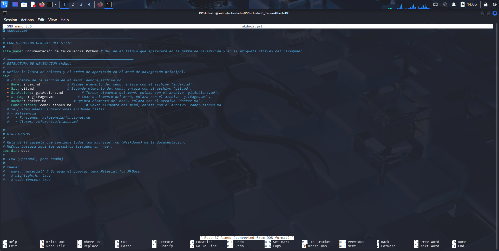

# 2. GitHub Actions + MkDocs

Este documento detalla el proceso de creación y comprobación del **WorkFlow de GitHub Actions** para la automatización de la documentación. El objetivo es que, con cada `git push` a la rama `main`, la documentación fuente (`docs/` y `mkdocs.yml`) se compile y se publique automáticamente en la rama `gh-pages`.

## 2.1. Configuración de MkDocs

Antes de crear el WorkFlow, es necesario configurar el generador de sitios estáticos **MkDocs**.

### 2.1.1. Archivo `requirements.txt`

Se define la dependencia de MkDocs en el archivo `requirements.txt` para que el WorkFlow pueda instalarla:

```bash
# requirements.txt
mkdocs
```

### 2.1.2. Archivo de Configuración `mkdocs.yml`

Se crea y configura el archivo `mkdocs.yml` en la raíz del repositorio. Este archivo define el nombre del sitio, el tema y la estructura de navegación.

> **Nota:** La estructura de navegación se actualizará a medida que se creen los archivos de documentación restantes.



## 2.2. Creación del WorkFlow de GitHub Actions

Se crea el archivo de WorkFlow en `.github/workflows/deploy_docs.yml` para definir los pasos de la Integración Continua (CI) que generarán y publicarán la documentación.

### 2.2.1. Archivo `deploy_docs.yml`

Este WorkFlow se dispara con cada `push` a la rama `main`, instala Python y MkDocs, y utiliza el comando `mkdocs gh-deploy --force` para construir y subir la documentación a la rama `gh-pages`.


## 2.3. Comprobación y Subida Inicial

Tras crear los archivos de configuración (`mkdocs.yml`, `requirements.txt`) y el WorkFlow, se realiza el _commit_ y el _push_ para disparar la primera ejecución del WorkFlow.
Bash

``` bash
# Comprobamos los nuevos archivos (si aún no se han subido)
git add .github/workflows/CreacionDocumentacion.yml mkdocs.yml requirements.txt
git commit -am "Añadido WorkFlow de MkDocs y configuracion inicial"
git push origin main
```

### 2.3.1. Verificación en GitHub Actions

Se comprueba la pestaña **Actions** del repositorio en GitHub para verificar que el WorkFlow **"Generar y Desplegar Documentación con MkDocs"** se haya ejecutado y completado exitosamente.


