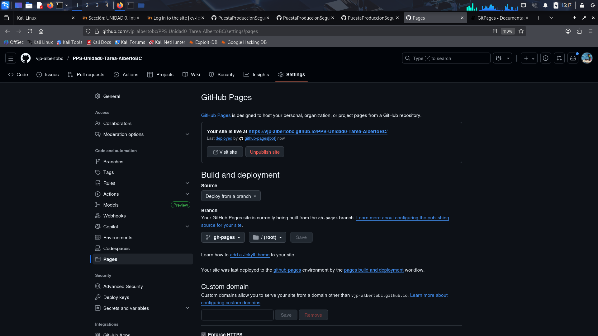
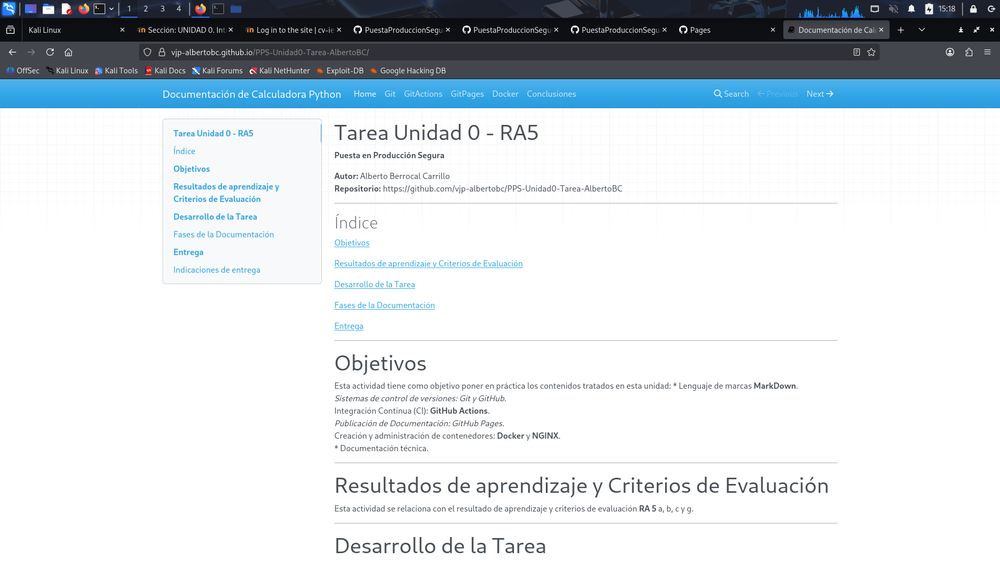

# 3.  Despliegue con GitHub Pages

Este documento detalla el proceso para activar y configurar el servicio de **GitHub Pages**. Este paso es crucial para que la documentación generada automáticamente por el WorkFlow de MkDocs (alojada en la rama `gh-pages`) sea accesible a través de una URL pública.

## 3.1. Configuración de la Fuente de Despliegue

Tras la primera ejecución exitosa del WorkFlow de GitHub Actions (documentada en `gitActions.md`), la rama **`gh-pages`** ya existe en el repositorio con los archivos HTML generados. Ahora solo falta indicarle a GitHub que use esa rama para el despliegue.

### Pasos:

1.  Navegar en GitHub al repositorio y acceder a **Settings** (Configuración).
2.  En el menú lateral, seleccionar la opción **Pages**.
3.  En la sección **"Build and deployment"** (Compilación y despliegue), se debe verificar que:
    * La opción **Source** esté establecida en **Deploy from a branch** (Desplegar desde una rama).
    * En el desplegable de **Branch** (Rama), seleccionar la rama **`gh-pages`**.
    * Asegurarse de que el directorio esté en la **raíz (/)**.
4.  Pulsar el botón **Save** (Guardar).

## 3.2. Verificación del Despliegue

Una vez guardada la configuración, GitHub Pages inicia el proceso de publicación. Esto puede tardar unos minutos.

### Pasos:

1.  Esperar a que GitHub Pages complete el despliegue. La página de **Settings > Pages** mostrará el mensaje "Your site is live at..." o similar, con la URL final.
2.  Hacer clic en el enlace proporcionado para verificar que la documentación se visualiza correctamente y que el índice de navegación está operativo (gracias a `mkdocs.yml`).

### URL Final de la Documentación

La URL pública sigue el formato `https://[Tu_usuario_github].github.io/[Nombre_del_Repositorio]/`.

## 3.3. Conclusión de CI/CD

Con la configuración de GitHub Pages completada, se establece un ciclo completo de **Integración y Despliegue Continuo (CI/CD)**:

1.  Se modifica un archivo Markdown en la carpeta **`docs/`** (o cualquier archivo en `main`).
2.  Se realiza un **`git push origin main`**.
3.  El WorkFlow de GitHub Actions se dispara (CI).
4.  MkDocs genera el HTML y lo sube a la rama `gh-pages`.
5.  GitHub Pages detecta el cambio en `gh-pages` y publica instantáneamente la nueva versión del sitio (CD).
